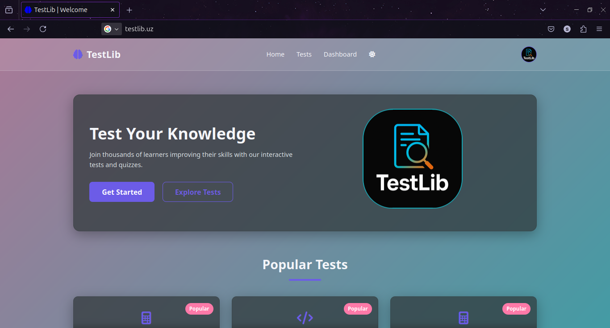

# 🧪 TestLib

**TestLib** — bu Django MVT arxitekturasiga asoslangan test kutubxonasi bo‘lib, foydalanuvchilarga turli kategoriyadagi testlar yaratish, boshqarish va baholash imkonini beradi.

---

## 📸 Screenshot


## 🚀 Xususiyatlar (Features)

- 📁 Testlar kategoriyalarga ajratilgan
- ⏱ Har bir test uchun boshlanish va tugash vaqti
- 🔄 Urinishlar sonini cheklash
- 🎯 Foiz orqali o‘tish mezonlari (pass percentage)
- 👤 Foydalanuvchi kirishi va test tarixini saqlash

---

## ⚙️ O‘rnatish (Installation)

```bash
# 1. Repositoryni klon qiling
git clone https://github.com/swe-samandar/Testlib.git or git@github.com:swe-samandar/Testlib.git
cd testlib

# 2. Virtual muhit yaratish va faollashtirish
python -m venv env
source env/bin/activate   # Windows: env\Scripts\activate

# 3. Paketlarni o‘rnatish
pip install -r requirements.txt

# 4. Migratsiyalarni qo‘llash
python manage.py migrate

# 5. Superuser yaratish (admin panelga kirish uchun)
python manage.py createsuperuser

# 6. Serverni ishga tushiring
python manage.py runserver

